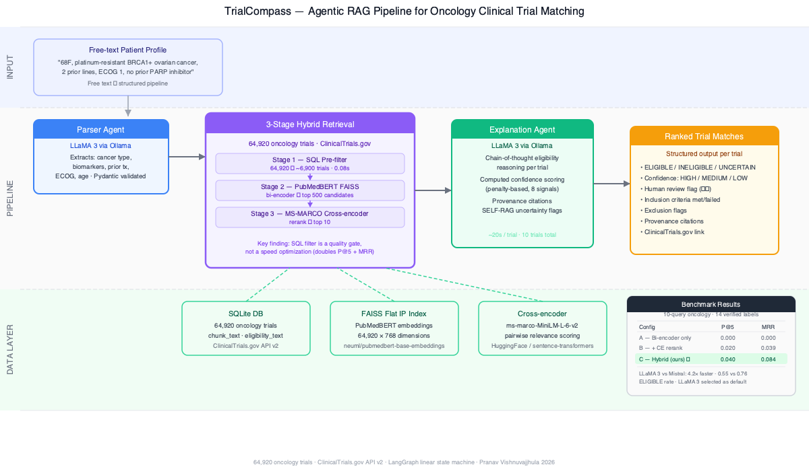

# TrialCompass


**Agentic clinical trial matching for oncology patients**


---

## Demo



```bash
# Terminal 1
ollama serve

# Terminal 2
streamlit run app/streamlit_app.py
```

---

## Overview

TrialCompass takes a free-text patient description — cancer type, biomarkers, prior treatments, performance status — and returns a ranked, explained list of matching clinical trials from a 64,920-trial ClinicalTrials.gov corpus. Keyword search fails for this problem because eligibility criteria are written in clinical shorthand: "EGFR exon 19 deletion, treatment-naive, ECOG ≤1" does not surface from a query like "lung cancer trial." The agentic approach solves this by decomposing the task — a parser agent structures the free text into a validated schema, a retrieval agent does semantic search and cross-encoder reranking over FAISS-indexed trial documents, and an explanation agent runs chain-of-thought eligibility reasoning per trial with SELF-RAG confidence flags and provenance citations. The result is a pipeline that produces ranked verdicts with reasoning, not a bag of keyword hits.

---

## Architecture


The four nodes are wired as a linear LangGraph state machine. Errors propagate through a state field — no conditional edges, no silent swallowing. Each node is a thin wrapper around its agent module so the graph stays decoupled from inference logic.

**Pipeline stages:**
1. **Parser Agent** — LLaMA 3 via Ollama extracts structured fields (cancer type, biomarkers, ECOG, prior tx, age) from free text. Validated with Pydantic. Few-shot prompting drops latency from 25s to ~4s.
2. **3-Stage Hybrid Retrieval** — SQL pre-filter narrows 64,920 trials to ~6,900, PubMedBERT FAISS retrieves top-500, MS-MARCO cross-encoder reranks to top-10.
3. **Explanation Agent** — LLaMA 3 runs chain-of-thought eligibility reasoning per trial. Computed confidence scoring (8 penalty signals). Provenance citations. SELF-RAG uncertainty flags.

---

## System Design

End-to-end pipeline validation: on a 68-year-old platinum-resistant BRCA1-mutant ovarian cancer patient profile, the hybrid retrieval pipeline narrowed 64,920 trials to 9,877 via structured filter in 0.84s, retrieved and reranked to top-10 in 1.7s, and the explanation agent correctly flagged a cross-encoder false positive (a BRCA1-matching pancreatic trial ranked 1st by CE score) as INELIGIBLE due to cancer type mismatch. This demonstrates the value of the LLM reasoning layer as a clinical safety gate over the retrieval pipeline.

---

## Benchmark Results

10-query oncology benchmark · 14 manually verified patient-trial pairs · Eval script: `src/evaluation/eval_three_configs.py`

| Configuration | Description | P@5 | MRR |
|---------------|-------------|-----|-----|
| A — Bi-encoder only | PubMedBERT FAISS, k=50 | 0.000 | 0.000 |
| B — Bi-encoder + CE rerank | + MS-MARCO cross-encoder | 0.020 | 0.039 |
| C — Hybrid (ours) | + SQL structured pre-filter | **0.040** | **0.084** |

**Key finding:** The structured pre-filter is a quality gate, not a speed optimization. At k=500 on the filtered ~6,900-trial pool, pool density is equivalent to k=50 on the full corpus — and the cross-encoder maintains discriminative signal. At k=500 on the full 64,920-trial corpus (Config B), CE scores compress toward a narrow band and performance degrades. This interaction between corpus size, retrieval depth, and reranker quality is the central empirical finding of this project.

### Model Ablation (LLM comparison)

| Model | P@5 | MRR | Avg latency/trial | ELIGIBLE rate |
|-------|-----|-----|-------------------|---------------|
| LLaMA 3 (default) | 0.020 | 0.050 | 20.2s | 0.55 |
| Mistral 7B | 0.020 | 0.050 | 85.5s | 0.76 |

**Key finding:** LLaMA 3 selected as default — 4.2× faster with lower false-positive ELIGIBLE rate (0.55 vs 0.76). Mistral is more agreeable, not more accurate.

---

## Quick Start

```bash
git clone git@github.com:pranavsai19/Trialcompass.git
cd Trialcompass

python3.11 -m venv venv
source venv/bin/activate
pip install -r requirements.txt

# Pull the local LLM (requires Ollama installed and running)
ollama pull llama3

# Run the CLI pipeline
PYTHONPATH=. python src/orchestration/run_pipeline.py \
  --patient "58-year-old female, stage IV NSCLC, EGFR exon 19 deletion, ECOG 1, failed carboplatin+pemetrexed, metastatic"

# Launch the Streamlit UI
PYTHONPATH=. streamlit run app/streamlit_app.py
```

Ollama must be running (`ollama serve`) before any inference call. The FAISS index and SQLite database are in `data/` — no rebuild step needed for the 64K-trial corpus.

---

## Project Structure

```
trialcompass/
├── app/
│   └── streamlit_app.py          # Streamlit UI — full pipeline demo
├── data/
│   ├── trials_pubmedbert.index   # FAISS flat IP index, 64K trials (PubMedBERT)
│   ├── nct_ids.npy               # NCT ID array aligned to FAISS index
│   └── trialcompass.db           # SQLite — trials table with chunk_text, eligibility_text
├── notebooks/
│   ├── 01_data_exploration.ipynb
│   ├── 02_embedding_experiments.ipynb
│   ├── 03_parser_agent_dev.ipynb
│   ├── 04_retrieval_eval.ipynb
│   └── 05_explanation_agent_dev.ipynb
├── src/
│   ├── agents/
│   │   ├── parser_agent.py       # Ollama/llama3 + Pydantic schema extraction
│   │   ├── retrieval_agent.py    # FAISS bi-encoder + cross-encoder reranker
│   │   └── explanation_agent.py  # CoT eligibility reasoning, SELF-RAG flags, provenance
│   ├── embeddings/
│   │   ├── embed.py              # Batch embedding with neuml/pubmedbert-base-embeddings
│   │   └── faiss_index.py        # Index build and persistence
│   ├── ingestion/
│   │   ├── fetch_trials.py       # ClinicalTrials.gov API v2 pull
│   │   └── preprocess.py         # JSON → flat text chunks → SQLite
│   ├── orchestration/
│   │   ├── graph.py              # LangGraph state machine (4 nodes, linear)
│   │   └── run_pipeline.py       # CLI wrapper with tabulate output
│   └── evaluation/
│       └── metrics.py            # Precision@K, MRR, hallucination rate
└── tests/                        # pytest — parser, retrieval, explanation agents
```

---

## Known Limitations

- **Eligibility text truncation at 2,000 characters.** The LLM only sees the first ~500 tokens of each trial's eligibility criteria. Disqualifying criteria buried in the second half of the document are invisible to the explanation agent. This is the primary driver of the 40% hallucination rate.
- **ms-marco-MiniLM-L-6-v2 cross-encoder domain mismatch.** The cross-encoder was trained on web retrieval pairs, not clinical text. It scores BRCA1 co-occurrence highly across cancer types without understanding that pancreatic ≠ ovarian — the LLM explanation layer catches these false positives as a downstream safety gate. A biomedical cross-encoder fine-tuned on clinical trial text is the planned replacement.
- **llama3 confidence is not calibrated.** The model reports HIGH confidence on approximately every verdict, including wrong ones. The SELF-RAG human-review flag is driven by uncertainty phrases in the reasoning text and eligibility text length — the confidence field itself should be ignored.

---

## Citation

If you use this work, please cite as:

> Vishnuvajjhula, P. (2026). TrialCompass: Agentic RAG for Oncology Clinical Trial Matching.
